# RealEstateApp

Plataforma de gestión inmobiliaria en ASP.NET Core 9 con arquitectura Onion, compuesta por una **WebApp MVC** para clientes, agentes y administradores, y una **WebAPI REST** protegida con JWT para administradores y desarrolladores. Ambas comparten la misma base de datos y el mismo esquema de usuarios y roles de ASP.NET Identity.

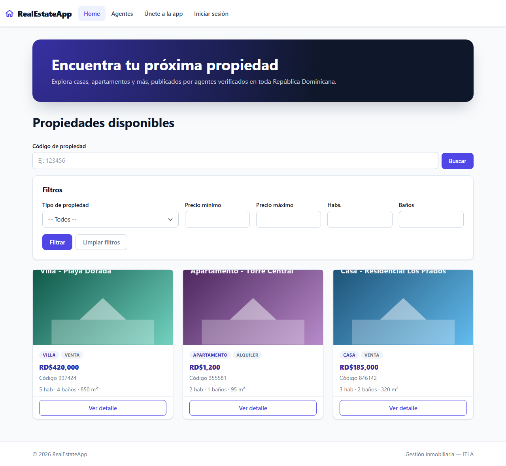

## WebApp

**Público**

- Home con propiedades disponibles ordenadas de la más reciente a la más antigua, búsqueda por código de 6 dígitos y filtros combinables por tipo, rango de precio, habitaciones y baños.
- Detalle de propiedad con galería de imágenes, mejoras y tarjeta del agente responsable.
- Listado de agentes activos con buscador por nombre y las propiedades de cada uno.
- Registro de clientes y agentes con foto. Los clientes se activan por el enlace del correo; los agentes los activa un administrador.

**Cliente**

- Marcar y desmarcar propiedades favoritas, y pantalla "Mis propiedades" que oculta las que ya no están disponibles.
- Chat con el agente responsable de cada propiedad.
- Ofertas en estado Pendiente, Aceptada o Rechazada, con bloqueo si ya hay una pendiente, una aceptada o la propiedad está vendida.

**Agente**

- Home con sus propiedades disponibles y vendidas, sin ver las de otros agentes.
- Mantenimiento de propiedades: creación con 1 a 4 imágenes, código único generado, mejoras, edición con imágenes actuales, eliminación con confirmación, bloqueo de edición y borrado de propiedades vendidas.
- Detalle con conversaciones por cliente, respuesta a mensajes y gestión de ofertas: aceptar una marca la propiedad como Vendida y rechaza las demás pendientes.
- Mi perfil con foto opcional.

**Administrador**

- Panel con indicadores de propiedades, agentes, clientes y desarrolladores.
- Listado de agentes con cantidad de propiedades, activación, inactivación y eliminación en cascada.
- Mantenimientos de administradores y desarrolladores, con protección del propio usuario y del último administrador activo.
- Mantenimientos de tipos de propiedad, tipos de venta y mejoras con validación de nombre único y cantidad de propiedades asociadas.

**Seguridad**

- Roles Cliente, Agente y Administrador con acceso denegado y enlace al Home del rol. Los desarrolladores no pueden entrar a la WebApp.
- Validación de usuario activo antes de autenticar, CSRF en formularios, imágenes validadas por firma de archivo.

## WebAPI

Rutas bajo `/api/v1`, documentadas en Swagger con autenticación Bearer.

| Controlador | Endpoints | Acceso |
|---|---|---|
| Account | `POST Login`, `POST RegisterAdmin`, `POST RegisterDeveloper` | Login público; registros solo Administrador |
| Properties | `GET`, `GET {id}`, `GET ByCode/{codigo}` | Administrador y Desarrollador |
| Agents | `GET`, `GET {id}`, `GET {id}/Properties`, `PATCH {id}/ChangeStatus` | Lectura ambos roles; cambio de estado solo Administrador |
| PropertyTypes, SaleTypes, Improvements | `GET`, `GET {id}`, `POST`, `PUT {id}`, `DELETE {id}` | Lectura ambos roles; escritura solo Administrador |

Un cliente o agente que intenta autenticarse recibe 403, un usuario inactivo 401, los listados vacíos 204 y los ids con formato inválido 400 con mensaje.

## Capturas

| Detalle público con galería | Registro |
|---|---|
| 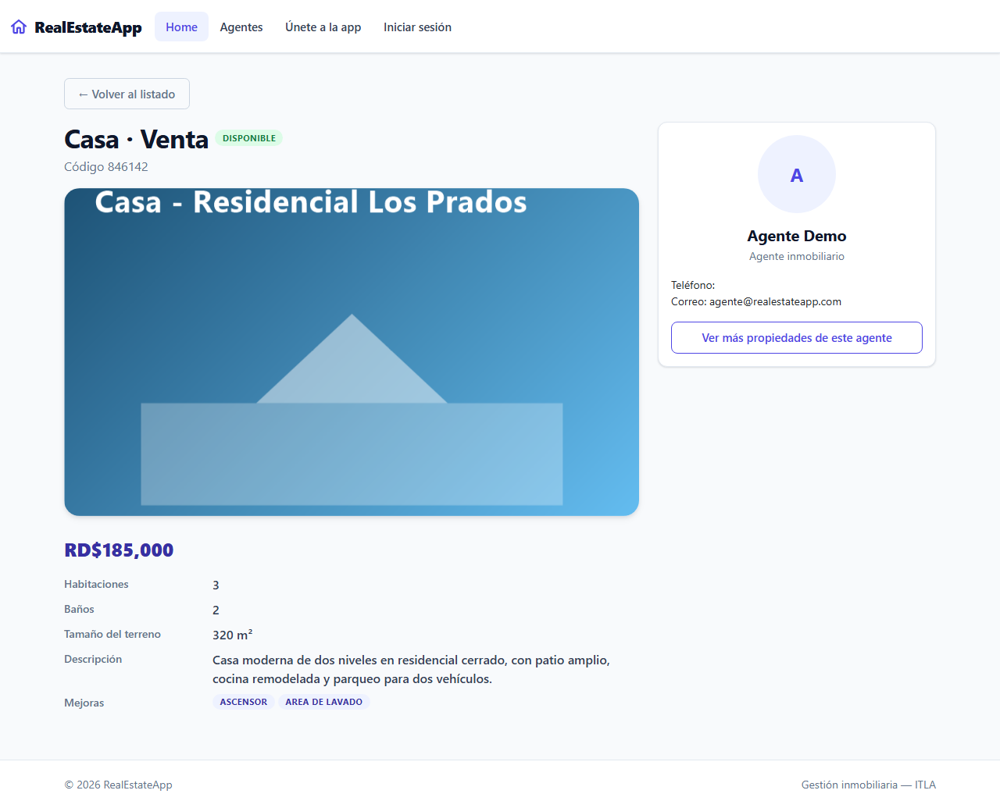 | 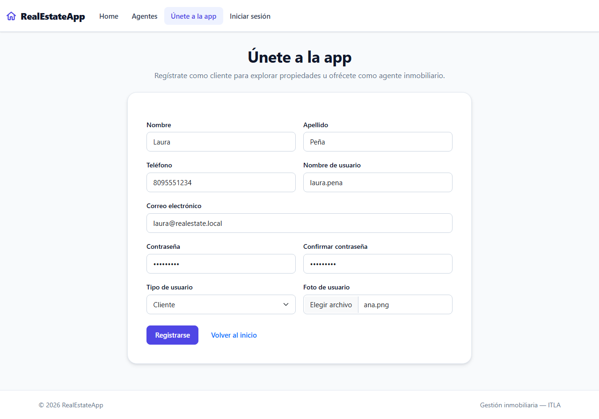 |

| Home del cliente con favoritos | Detalle del cliente con chat y ofertas |
|---|---|
| 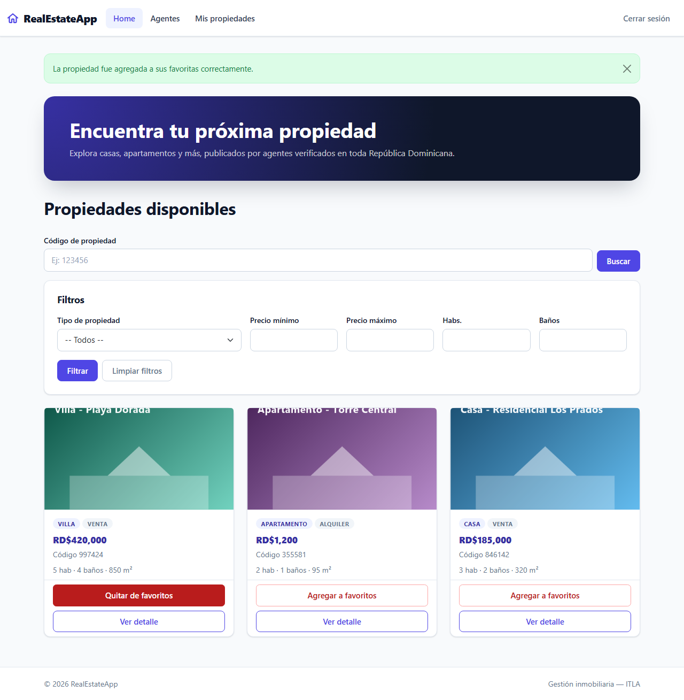 | 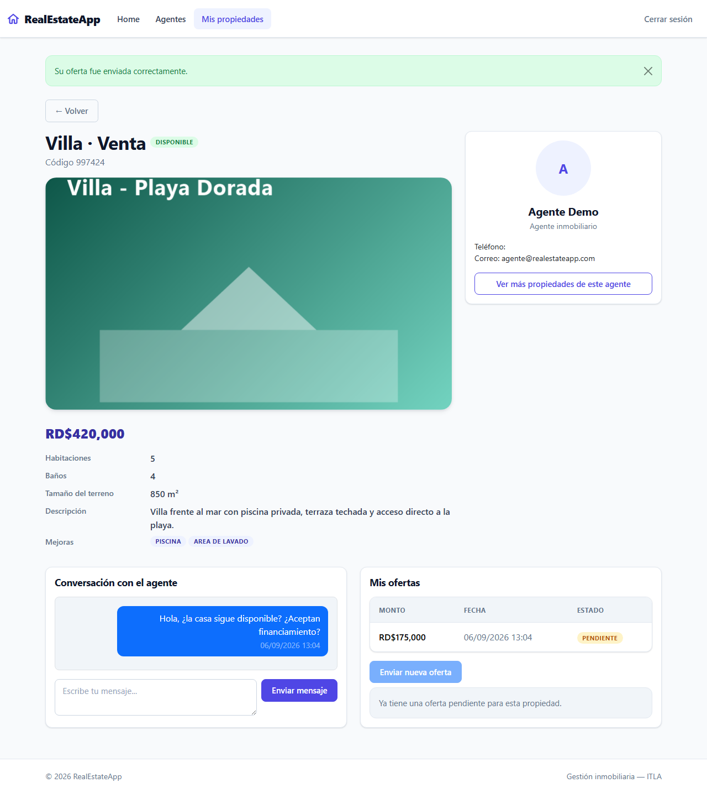 |

| Detalle del agente: conversaciones y ofertas | Home del agente con propiedad vendida |
|---|---|
| 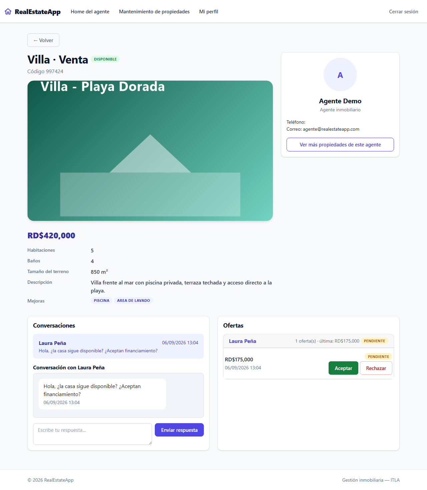 | 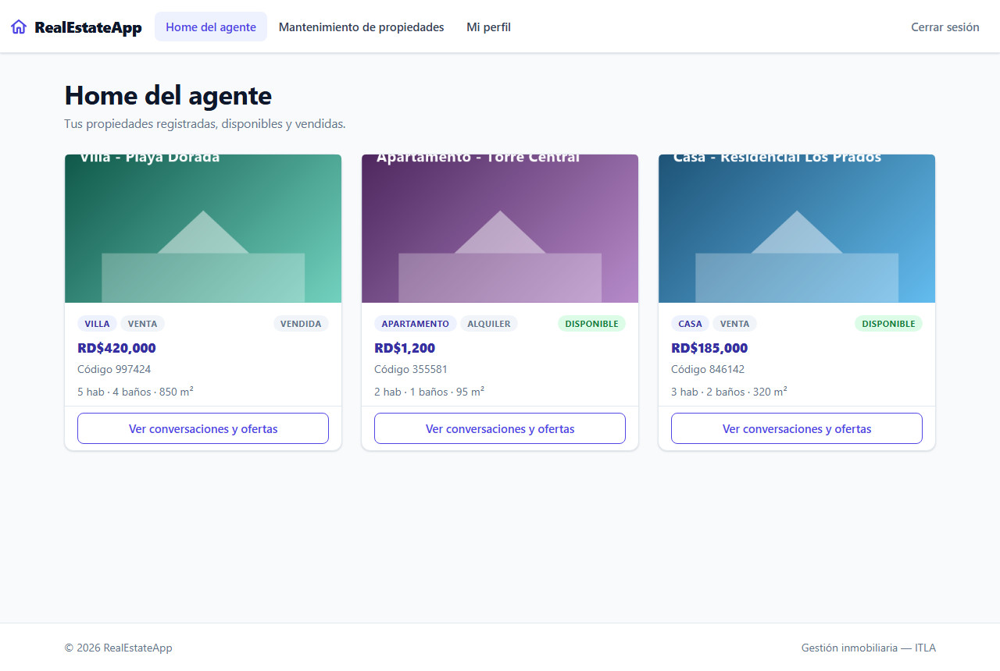 |

| Crear propiedad | Panel del administrador |
|---|---|
| 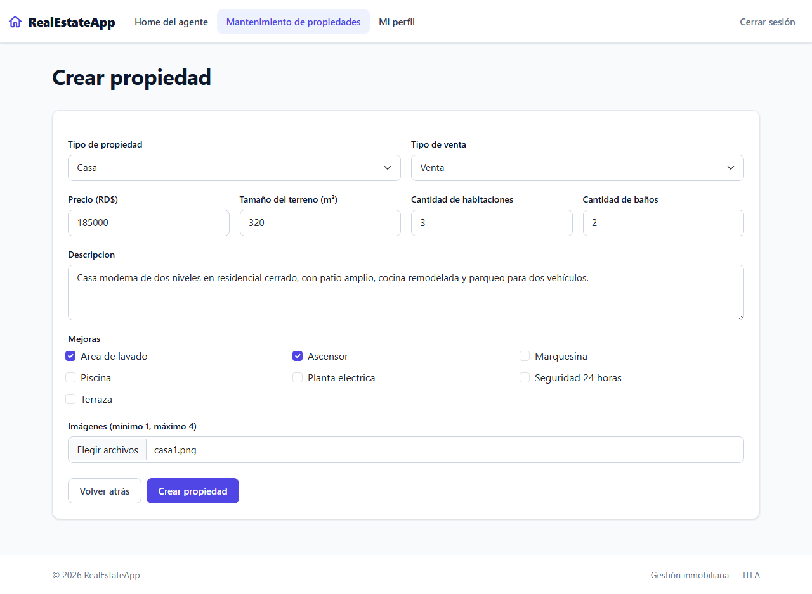 | 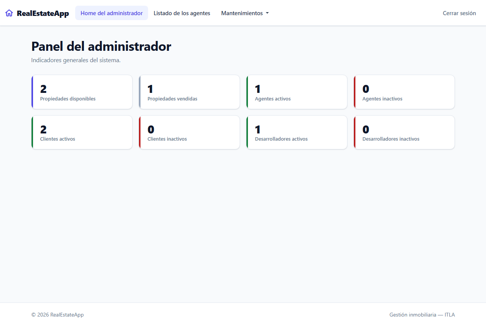 |

| Listado de agentes (admin) | Swagger de la WebAPI |
|---|---|
| 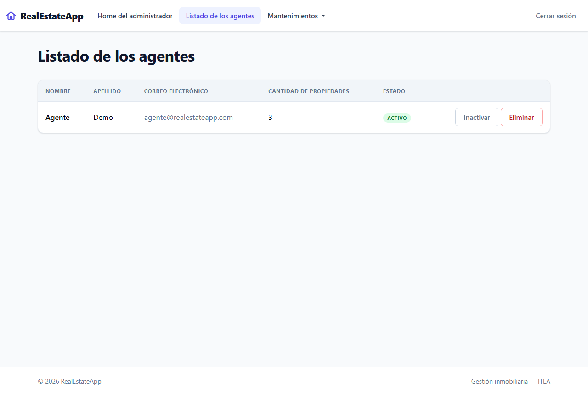 | 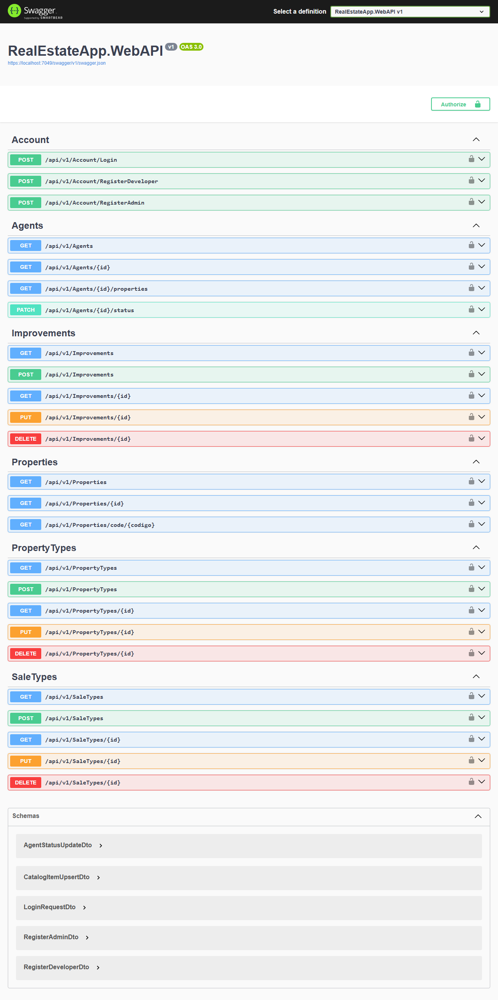 |

## Arquitectura

```
RealEstateApp.sln
├── RealEstateApp.Core            Entidades, enums, DTOs, ViewModels e interfaces (sin dependencias)
├── RealEstateApp.Infrastructure  DbContext de Identity, configuraciones Fluent API, repositorio y servicios genéricos, servicios de negocio, migraciones y seed
├── RealEstateApp.Shared          Correo (MailKit) y almacenamiento de imágenes
├── RealEstateApp.WebApp          MVC con cookies de Identity, ViewModels y AutoMapper
└── RealEstateApp.WebAPI          Controladores REST con JWT, DTOs y Swagger
```

- Las dependencias apuntan hacia `Core`. WebApp y WebAPI no se referencian entre sí; ambas registran la misma infraestructura y comparten el store de Identity.
- Controladores delgados: validan el modelo y delegan en servicios. Las reglas de negocio, como aceptar una oferta o eliminar un agente con sus propiedades, viven en `Infrastructure/Services`.
- Correo: con SMTP configurado envía por MailKit. Sin configurar, guarda cada correo como HTML en `RealEstateApp.WebApp/App_Data/correos`, lo que permite probar la activación de clientes sin credenciales.

## Cómo ejecutarlo

Requisitos: SDK de .NET 9 y SQL Server. La cadena de conexión por defecto apunta a `localhost\MSSQLSERVER01`; ajústela en `appsettings.json` de ambos hosts o con una variable de entorno.

```bash
git clone https://github.com/MarioMahir/RealEstateApp.git
cd RealEstateApp
dotnet dev-certs https --trust
dotnet run --project RealEstateApp.WebApp --launch-profile https
dotnet run --project RealEstateApp.WebAPI --launch-profile https
```

Al arrancar, cada host aplica las migraciones y siembra roles, catálogos y estos usuarios:

| Rol | Usuario | Contraseña |
|---|---|---|
| Administrador | `admin@realestateapp.com` | `Admin123$` |
| Desarrollador | `desarrollador@realestateapp.com` | `Developer123$` |
| Agente | `agente@realestateapp.com` | `Agente123$` |
| Cliente | `cliente@realestateapp.com` | `Cliente123$` |

WebApp: https://localhost:7222. WebAPI y Swagger: https://localhost:7049/swagger.

Para probar la API desde la terminal:

```bash
curl -k -X POST https://localhost:7049/api/v1/Account/Login \
  -H "Content-Type: application/json" \
  -d '{"usuarioOCorreo":"admin@realestateapp.com","contrasena":"Admin123$"}'
```

### Correo real (opcional)

Las credenciales no están en el repositorio. Configúrelas con user-secrets o variables de entorno (`EmailSettings:Host`, `Port`, `User`, `Password`, `From`). Con Gmail se necesita una contraseña de aplicación. La clave JWT de `appsettings.json` de la WebAPI es solo para desarrollo; en un despliegue real reemplácela por una configurada fuera del repositorio.

## Stack

ASP.NET Core 9 MVC y Web API, ASP.NET Core Identity, JWT Bearer, Entity Framework Core 9 (Code First, SQL Server), AutoMapper, MailKit, Swagger (Swashbuckle), Bootstrap 5.

## Equipo

Mini proyecto final del módulo de Programación III (ITLA, 2026).
